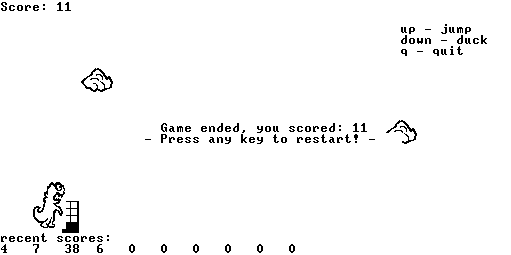

# Monster Runner

Monster Run is a simple yet engaging game where you play as a monster running through a city, avoiding buildings and airplanes. The game is inspired by Google's Chrome offline dinosaur game. This project is part of the Nand2Tetris course, specifically Project 9 from Part II. 

## Table of Contents
- [Game Description](#game-description)
- [Installation](#installation)
- [Usage](#usage)
- [Screenshots](#screenshots)
- [Files](#files)


## Game Description
In Monster Run, you control a monster running through a cityscape. Your goal is to avoid obstacles such as buildings and airplanes by jumping over them or ducking under them. The game increases in difficulty as you progress, providing a fun and challenging experience.

## Installation
To run the game, you'll need the Nand2Tetris tools installed on your system. Follow these steps to get started:
1. Clone this repository to your local machine:
    ```sh
    git clone https://github.com/ItamarBaer/Nand-Monster-Run.git
    ```
2. Navigate to the project directory:
    ```sh
    cd monster-runner
    ```
3. Ensure you have the VM emulator set up. You can download the necessary tools from the [Nand2Tetris website](https://www.nand2tetris.org/software).

## Usage
1. Run the VM emulator and load the VM files:
    ```sh
    ./tools/VMEmulator.sh ./vm_files
    ```
3. Start the game and enjoy!

## Screenshots
Here are some screenshots from the game:





## Files
- `jack_files/`: Contains the Jack source code for the game.
- `vm_files/`: Contains the compiled VM code.
- `sprites/`: Contains PNG images of the game sprites.
- `screenshots/`: Contains screenshots of the game.
